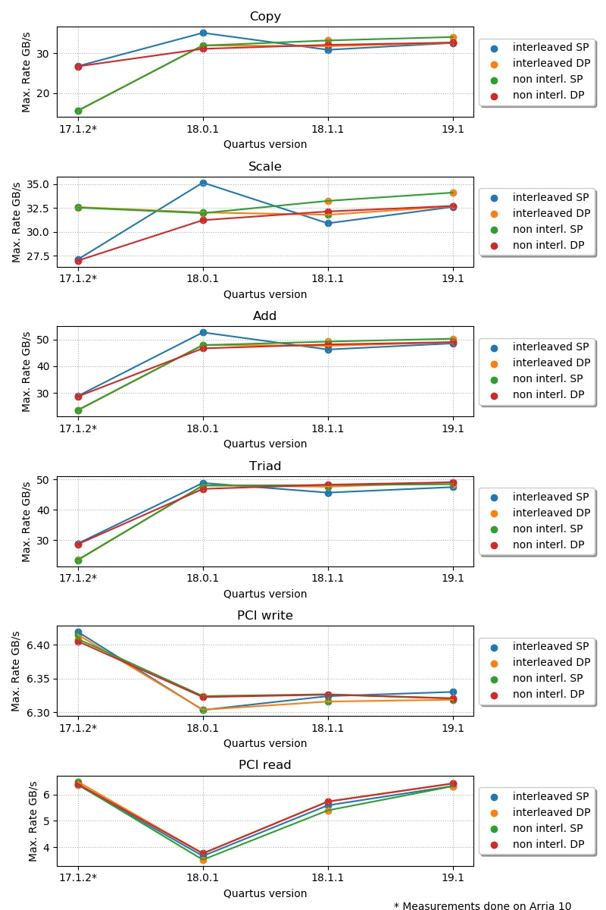

# STREAM for FPGA

This repository contains the STREAM benchmark for FPGA and its OpenCL kernels.
Currently only the  Intel® FPGA SDK for OpenCL™ utility is supported.

It is a modified implementation of the STREAM benchmark by John D. McCaplin, Ph.D.
available at [https://www.cs.virginia.edu/stream/](https://www.cs.virginia.edu/stream/).

## Build

Depending on the use case you may want to change certain lines in the
Makefile:
     
1. Check the location of the used compilers (A C++ compiler and the aoc/aocl)
2. Update the board name in the Makefile or give the new board name as an argument 
   to make.
3. Set the used data type using the STREAM_TYPE variable and the number the for
   loops in the kernels should be unrolled with UNROLL_COUNT.
4. Build the host program or the kernels by using the available build targets.

For more detailed information about the available build targets call:

    make
without specifying a target.
This will print a list of the targets together with a short description.

Similar to the original STREAM benchmark it is also possible to modify the 
size of the used buffers as well as the number of iterations with the variables
STREAM_ARRAY_SIZE and NTIMES.

To make it easier to generate different versions of the kernels, it
is possible to specify a variable BUILD_SUFFIX when executing make.
This suffix will be added to the kernel name after generation.

Example:
		
	make host BUILD_SUFFIX=18.1.1

Will build the host and name the binary after the given build suffix.
So the host would be named 'stream_fpga_18.1.1'.
The file will be placed in a folder called 'bin' in the root of this project.

## Execution

The created host uses the kernel with the same build suffix by default.
It tries to load it from the same directory it is executed in.
   
    ./stream_fpga_18.1.1 

will try to load the kernel file with the name
stream_kernels_18.1.1.aocx by default.
Additionally, the executable will interpret the first argument given as
the path to the kernel that should be used.
For example to use the kernel 'other.aocx':

    ./stream_fpga_18.1.1 other.aocx

Also, relative and absolute paths to the kernel can be given.

## Result interpretation

The output of the host application is similar to the original STREAM benchmark:

	Function    Best Rate MB/s  Avg time     Min time     Max time
	Copy:           30875.9     0.025914     0.025910     0.025919
	Scale:          30885.6     0.025905     0.025902     0.025911
	Add:            46289.2     0.025928     0.025924     0.025935
	Triad:          45613.4     0.026310     0.026308     0.026312
	PCI Write:       6324.0     0.189800     0.189753     0.189862
	PCI Read:        5587.3     0.214869     0.214773     0.214943

In addition it also measures the bandwidth of the connection between host and
device. It is distinguished between writing to and reading from the devices
memory.
The buffers are written to the device before every iteration and read back
after each iteration.

## Exemplary Results 

The benchmark was executed on Bittware 520N cards for different Intel® Quartus® Prime versions.
The detailed results of the runs are given in [results.txt](results.txt).
The best achieved data rates for the tested Intel® Quartus® Prime versions:

